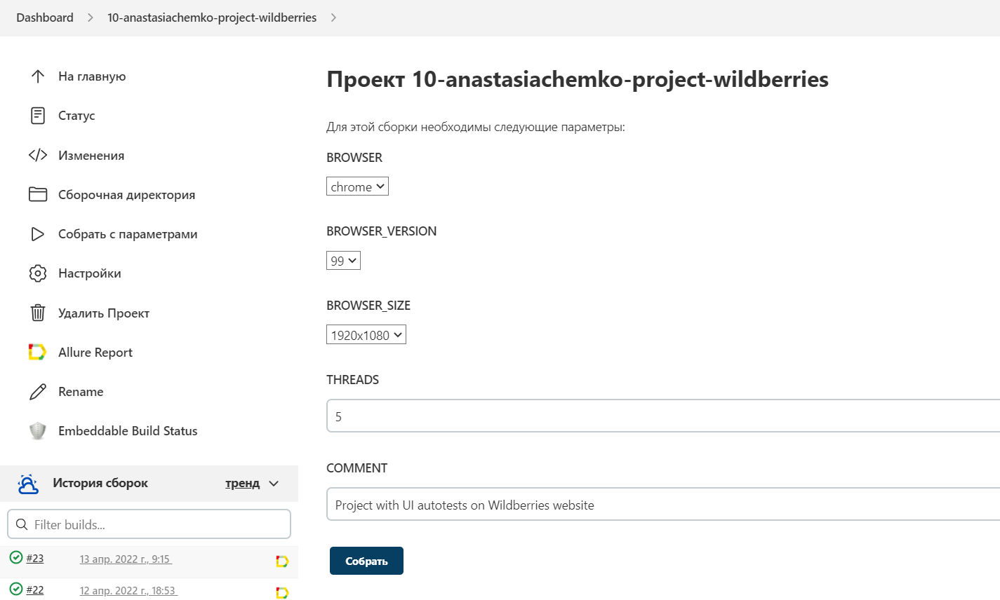
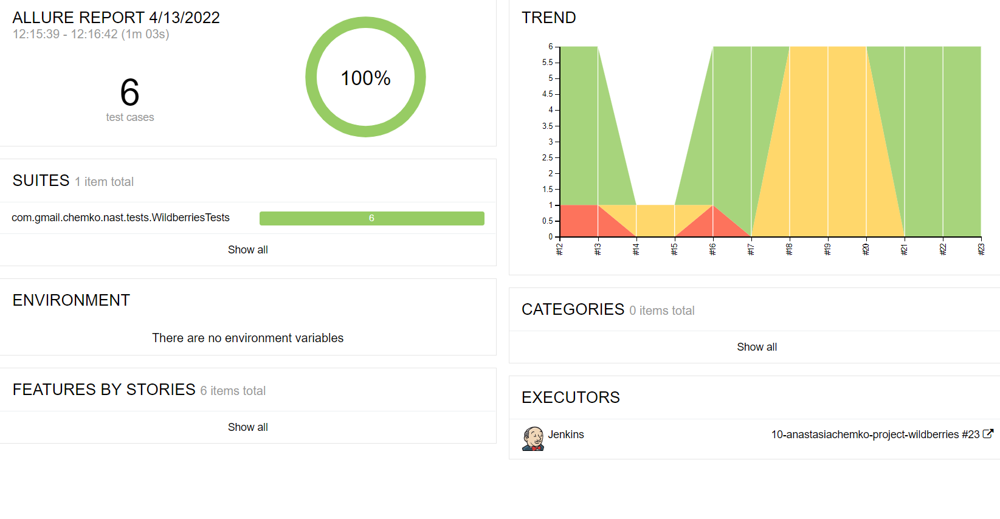
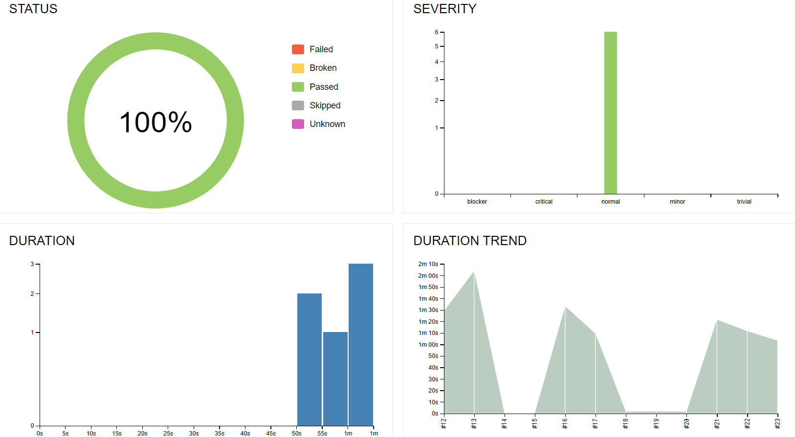
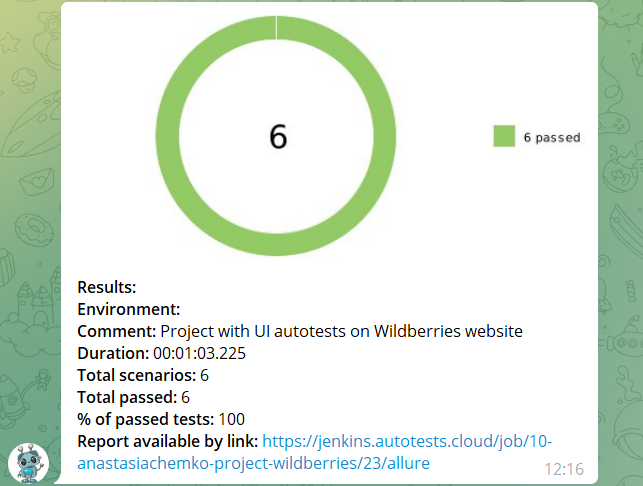

# This is the Project with UI Autotests for 'Wildberries' website
Click [here](https://by.wildberries.ru/) to take a look at the website!

## Technology Stack used in the project:

<p align="center">
<a href="https://www.jetbrains.com/idea/"></a>
<a href="https://www.java.com/"></a>
<a href="https://github.com/"></a>
<a href="https://junit.org/junit5/"></a>
<a href="https://gradle.org/"></a>
<a href="https://selenide.org/"></a>
<a href="https://aerokube.com/selenoid/"></a>
<a href="https://github.com/allure-framework/allure2"></a>
<a href="https://www.jenkins.io/"></a>
<a href="https://web.telegram.org/"></a>
</p>

## What is special about this project:

- PageObjects
- Parameterized build
- Owner.config
- Telegram notifications

## To run tests locally use:

```
gradle clean test 
```

## Jenkins job
Jenkins is an automation server which lets us run tests

Click <a target="_blank" href="https://jenkins.autotests.cloud/job/10-anastasiachemko-project-wildberries">here</a> to see the job for Wildberries website

Here is a sneak peek of how you can run the tests and which parameters you can specify:

<p align="center">

</p>

## Allure report
Allure Framework is a flexible test report tool that shows a concise representation of what have been tested in a neat web report form

Click <a target="_blank" href="https://jenkins.autotests.cloud/job/10-anastasiachemko-project-wildberries/24/allure/#">here</a> to see the report of the tests

Here are an overview and graphs:

<p align="center">

</p>

<p align="center">

</p>

## Telegram notifications
Notifications of test results are sent to Telegram:

<p align="center">

</p>

## Video example of a running test


